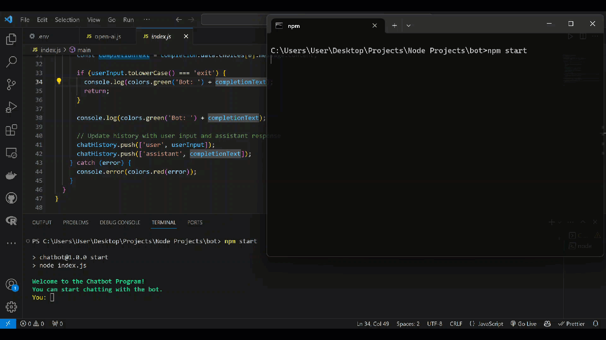

# ChatGPT Chatbot

This repository houses a Node.js-based ChatGPT chatbot designed to operate within the terminal.

## Demo


## Usage

Get your OpenAI API key at https://platform.openai.com/account/api-keys

Create a file named `.env` and add the following:

```
OPENAI_API_KEY=YOURKEY
```

## Usage

#
1. Clone the repository:

   ```bash
   git clone https://github.com/iAlex0/chatgpt-bot.git

#
2. Install dependencies:

```bash
npm Install
```

#
3. Run the bot:

```bash
npm start
```

## License
MIT © iAlex0